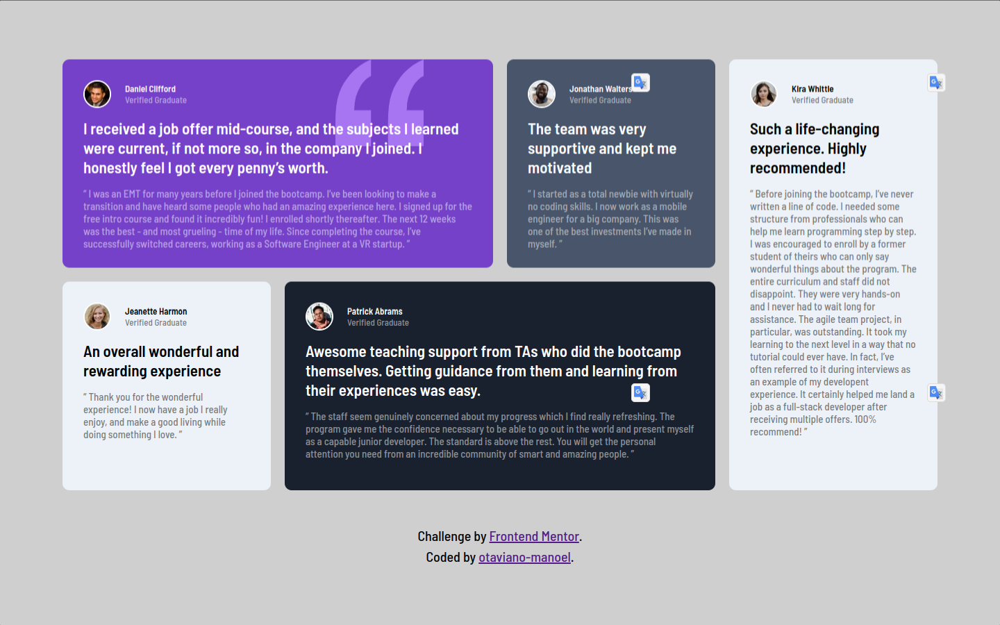

# Frontend Mentor - Testimonials grid section solution

This is a solution to the [Testimonials grid section challenge on Frontend Mentor](https://www.frontendmentor.io/challenges/testimonials-grid-section-Nnw6J7Un7). Frontend Mentor challenges help you improve your coding skills by building realistic projects. 

## Table of contents

- [Overview](#overview)
  - [The challenge](#the-challenge)
  - [Screenshot](#screenshot)
  - [Links](#links)
- [My process](#my-process)
  - [Built with](#built-with)
  - [What I learned](#what-i-learned)
  - [Continued development](#continued-development)
  - [Useful resources](#useful-resources)
- [Author](#author)

## Overview

### The challenge

Users should be able to:

- View the optimal layout for the site depending on their device's screen size

### Screenshot




### Links

- Solution URL: [Solution URL here](https://your-solution-url.com)
- Live Site URL: [Live site URL here](https://your-live-site-url.com)

## My process

### Built with

<code></code>
<code></code>


### What I learned

During the development of this challenge, I practiced my use of the CSS Grid. The CSS Grid applied to the [div class="container"] turned it into a grid divided into 4 columns and 2 rows for larger screens, and 1 column with multiple rows for each message. Dividing this object into a grid allows me to easily arrange the child elements and better define their sizes, as it's as simple as placing them in cells to adapt to the size of the cells.

The display grid is declared like this.
```html
<div class="container"></div>
```
```css
.container {
    display: grid;
    grid-template: repeat(2, 300px) / repeat(4, 300px);
    grid-gap: 20px;
}
```

Here's an example of how I specify in which grid cell the HTML elements are positioned.
```html
<div class="menssege item-1"></div>
```
```css
.menssege.item-1 {
    background-color: hsl(263, 55%, 52%);
    /**
    grid-row-start: 1;
    grid-column-start: 2;
    grid-row-end: 3;
    grid-column-end: 4;
    **/
    grid-area: 1 / 1 / 1 / span 2;
}
```

### Continued development

 I will continue using the display grid in my next project because I feel that I don't have a strong grasp of this property yet.

### Useful resources
- [W3Schools](https://www.w3schools.com/css/default.asp) - 
I used W3Schools to clarify my doubts and I really liked their examples, which clarify how to use CSS properties.
- [MDN Web Docs](https://developer.mozilla.org/pt-BR/) - I'd like you to get to know MDN Web Docs, which helped me a lot in understanding HTML tags.

## Author

- Frontend Mentor - [@Otaviano-Manoel](https://www.frontendmentor.io/profile/Otaviano-Manoel)
